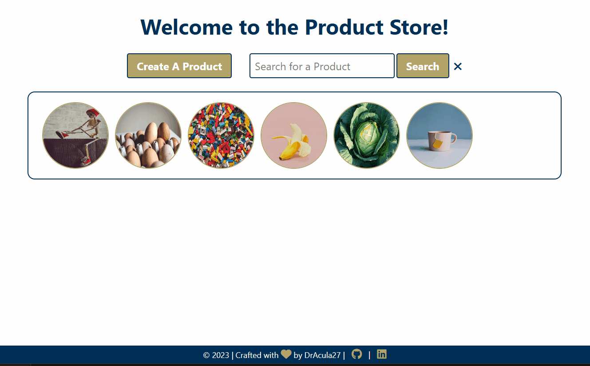

<h1 align="center">Welcome to productStore!</h1>

  
  
  
  
  
  

> Per Scholas - Week 9 - Front-end, Express, and MongoDB - MODULE 2 PROJECT: Product Store

> This is the second major project through my Software Engineering course at Per Scholas. It simulates an online web store / inventory management system where you can view(**read**), browse, search for, **create**, **update**, buy, and **delete** products. It combines both front-end (`HTML`, `CSS`, `JavaScript`) and back-end (`Node.js`, `Express.js`, `MongoDB`, `Mongoose`) technologies.

## Demo

### 🏠 [Homepage](https://github.com/DrAcula27/productStore#readme)

## Author

👤 **Danielle Andrews**

- Github: [@DrAcula27](https://github.com/DrAcula27)
- LinkedIn: [@daniellerandrews](https://linkedin.com/in/daniellerandrews)

## Project Details and Minimum Viable Product (MVP) to Pass

**Navigation between pages should be done with a `navbar` (using JS to switch html files) AND/OR by clicking on things in the page (JS switches html files)**

### Pages

1. HOME page (index):
   - All the products are displayed.
   - The user can visit each product from here.
   - If the user clicks on the image, it links to the PRODUCT page.
   - There is a link to add a new product.
1. PRODUCT page:
   - Shows specific product and it’s details.
   - Has a link back to the HOME page.
   - Has a link to edit the product that goes to the EDIT page.
   - Has a delete button that deletes that specific product.
   - The user can also search for a specific product from this page.
   - Clicking the buy button should lower the remaining inventory by 1.
   - If the quantity of the product is zero, its product page should say 'OUT OF STOCK' instead of saying how many are remaining.
   - The BUY button should not be rendered if the product is out of stock.
1. EDIT page:
   - Allows the user to edit the data of a specific product using it’s product ID.
1. CREATE page:
   - Allows for the creation of new products (users will include a URL for the image).

### Redirects

1. The `create` route should redirect to HOME after creation.
1. The `delete` route should redirect to HOME after deletion.
1. The `edit` route will redirect to the edited product's PRODUCT page after the object is changed in the collection.

### Routes

1. `/get_products` - responds with all products in the collection.
1. `/get_specific_product/:product_id` - responds with one specific product from the collection.
1. `/create_product` - uses information from `req.body` to make a new product in the collection.
1. `/delete_product` - uses the product ID in the URL as a query.
   - Example: `/delete_product/?productId=63cd55e8b260470b1c1f2cc0`
1. `/update_product` - uses information from `req.body` to update the specific product.

### Technical Requirements

1. The app must run without syntax errors.
1. The app must contain all routes listed above.
1. The app must be styled and look like a store.
1. The app must have a well documented README file.
   - Add this README.md file manually, NOT through GitHub.
1. Create a video showcasing the application and code. This video needs to be in the README file.

## Tech Stack

This project uses 3 of the 4 components of the MERN stack.

- **M** -  [MongoDB](https://www.mongodb.com/)
- **E** -  [Express](https://expressjs.com/)
- **N** -  [Node](https://nodejs.org/en/)

## Future Work

- Add the ability to add products to a cart and then purchase them all in one click.

## Attributions

- Favicon: <a href="https://www.flaticon.com/free-icons/shop" title="shop icons">Shop icons created by srip - Flaticon</a>
- Icons are from [Fontawesome](https://fontawesome.com/).
- Product images are from [Unsplash](https://unsplash.com/).
- Colors are official [Georgia Tech](https://www.gatech.edu/) brand colors.

## Show Your Support

Give a ⭐️ if you liked this project!

---

_This README was generated with ❤️ by [readme-md-generator](https://github.com/kefranabg/readme-md-generator)_
